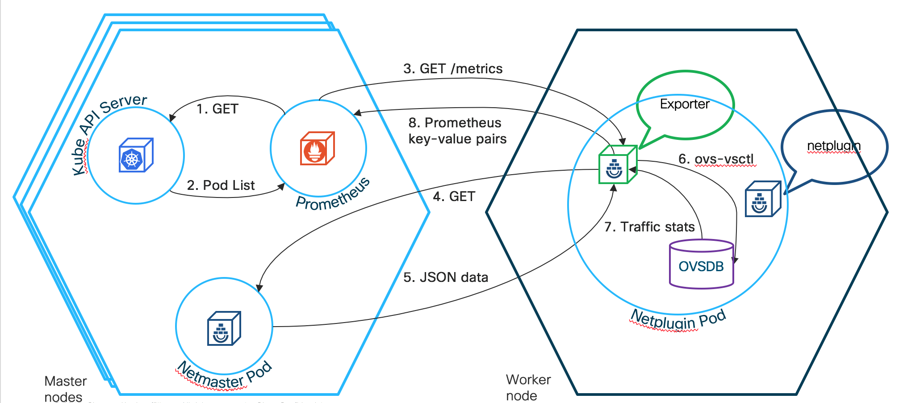

# Contiv Prometheus Integration for Kubernetes

## Getting Started

In order to run this exporter for your cluster, please follow [this](http://contiv.github.io/documents/tutorials/prometheus-tutorial.html) tutorial.

## Summary

There are two disparate data sources within Contiv, Netmaster and Open vSwitch database. Netmaster has data on tenants, networks, endpoint groups, and endpoint IDs. OVS has traffic statistics for each endpoint ID. We would like to correlate the data from Netmaster with the OVS data by matching the endpoint IDs. Prometheus is an open-source monitoring platform that can gather data from a system. Prometheus only accepts key-value pairs as its data input. In order to correlate the data and transform it into key-value pairs, an exporter is needed.

### Prometheus configuration

Please find the configuration for Prometheus in the [this](https://github.com/contiv/stats_exporter/blob/master/prometheus.yml) .yml file. This .yml file is volume mounted from `/var/contiv` within the VM to the Prometheus replica set configured in [this](https://github.com/contiv/stats_exporter/blob/master/contiv-prometheus.yml) file. Prometheus runs as a Kubernetes service within the cluster. Through RBAC, it is given access to get, list, and watch pods. 

### Netplugin/Netmaster exporters

The exporter is deployed as a container alongside the Netplugin and Netmaster pods. Find the container configuration [here](https://github.com/contiv/stats_exporter/blob/master/Dockerfile). The exporter is written in Ruby. Ruby has many useful libraries that make retrieving the statistics and parsing them easy. Since Prometheus sends GET requests to retrieve the stats, the exporter must be set up as a web server which is also easy to do in Ruby.  Sinatra is a web application library for Ruby that is small, fast, and sufficient for the exporter to use. The exporter is set up as a Sinatra HTTP web server providing a /metrics REST endpoint at port 9004 for Netplugin pods and 9005 for Netmaster pods.

### Netplugin/Netmaster configuration

Any Kubernetes pod that has `prometheus.io/scrape: ‘true’` and `prometheues.io/port: ‘####’` (where #### is the port where the metrics are exposed at) will get scraped. Follow [this](https://github.com/contiv/install/blob/master/install/k8s/k8s1.6/contiv.yaml) link to see these annotations for the Netplugin and Netmaster pods.

### OVS details

Open vSwitch has a local database per Netplugin pod where it stores information about the system and traffic flows. As long as Open vSwtich is installed within the system, the local database can be accessed through the command line interface. 
`ovs-vsctl --db=tcp:127.0.0.1:6640 list interface | egrep '^name|external_ids|statistics`
The command above says that the database can be accessed using the TCP protocol and that it is exposed on localhost on port 6640. The “list interface” command provides information about each of the interfaces that is on the local machine. The most useful information from this output is the name, external ID numbers, and statistics. The external ID numbers are unique and are assigned to each endpoint. These IDs are assigned by Kubernetes.

### Exporter Pipeline

The full pipeline to retrieve data from the system and display it on Prometheus is as follows:

1. Prometheus sends an HTTP GET request to the Kube API server. 

2. In return, the Kube API server sends back a list of pods that Prometheus must go to and fetch data from.

3. Prometheus sends an GET request to the exporters by referencing the list of pods it received from the Kube API server. This GET request hits the /metrics REST endpoint.

4. The body of the exporter is now executed. The exporter will send a GET request to Netmaster. Find the code for the exporter [here](https://github.com/contiv/stats_exporter/blob/master/exporter.rb).

5. Netmaster returns JSON-formatted data which is parsed through by the exporter.

6. The exporter then executes a command to get information from Open vSwitch which is spawned as a child process. 

7. OVS returns back endpoint traffic stats. Data from OVS is correlated with the data from Netmaster.

8. The exporter returns back key-value pairs to Prometheus. 

This complete pipeline is repeated every 5 seconds.